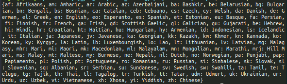
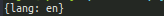
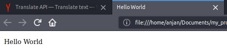
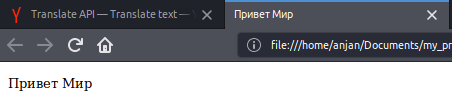

# translate
A simple to use Dart package, for detecting &amp; translating *text* and *html pages* using Yandex.Translate API

Show some :heart:, by putting :star:

**This package is readily avaiable for [use](https://pub.dev/packages/translate).**

## what does it do ?
- Fetches list of languages along with language codes, supported by Yandex.Translate API
- Detects which language given text belongs to
- Translates text or html page to certain language, denoted by language code

## How to use ?
First get yourself a *Yandex.Translate* API Key, which can be found [here](https://translate.yandex.com/developers/keys).

<u><b>Fetch list of supported language :</u></b>
```dart
Languages('api_key')
      .fetch()
      .then(
        (data) => print(data),
        onError: (e) => print(e),
      ).then((val) => exit(0));
```


Response in case of success,
```json
{
    ru: 'Russian',
    en: 'English',
}
```
Response in case of error,
```json
{
    error: ' ... '
}
```
<u><b>Detect language of text :</u></b>
```dart
DetectIt('api_key')
      .detect('Hello World', hint: [
        'en',
        'de',
        'ru',
        'hi',
      ]) // hints are to be prioritized by platform while detecting language, if provided
      .then(
        (data) => print(data),
        onError: (e) => print(e),
      )
      .then((val) => exit(0));
```


Response in case of success,
```json
{
    lang: 'en'
}
```
Response in case of error,
```json
{
    error: ' ... '
}
```
<b><u>Translate Text :</u></b>
```dart
TranslateIt('api_key')
      .translate(
          '<!DOCTYPE html><html><head><title>Hello World</title></head><body><p>Hello World</p></body></html>',
          'en-ru', // only `ru` will also do same job
          type: 'html') // type is `html`, cause this text is markedup
      .then(
        (data) => print(data),
        onError: (e) => print(e),
      )
      .then((val) => exit(0));
```
English | Russian
--------|---------
|
------------------

Response in case of success,
```json
{
    text: ' ... '
}
```
Response in case of error,
```json
{
    error: ' ... '
}
```
## Courtesy :
Translation API is powered by [Yandex.Translate](https://translate.yandex.com/), so all thanks goes to them. 

If you're interested in learning more about T&C, take a look [here](https://tech.yandex.com/translate/doc/dg/concepts/design-requirements-docpage/).

You can also go for [priced version](https://translate.yandex.com/developers/prices).

Hoping, it was helpful :wink:
